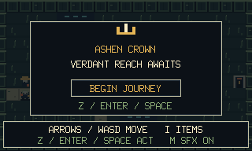
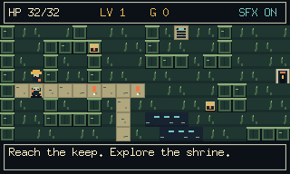
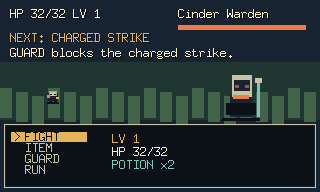
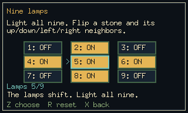

# Ashen Crown

A small, keyboard-controlled JRPG built with **Go** and **Ebitengine**. Explore Verdant Reach, prepare for turn-based battles, uncover an optional puzzle shrine, and defeat the Cinder Warden.

The game draws pixel art on a **320 × 192** canvas and uses synthesized retro sound effects. The desktop window starts at three times the canvas size and can be resized.



## Features

- A scrolling overworld, treasure chests, a merchant, and a separate shrine dungeon.
- Turn-based combat with visible enemy intentions, charged attacks, guarding, and healing items.
- XP, level increases, gold, a weapon upgrade, and a shrine blessing.
- Three puzzle chambers: rune ordering, a nine-lamp circuit, and spectral offerings.
- Damage and healing numbers, hit flashes, block indicators, and a victory jingle.

| Verdant Reach | Combat |
| --- | --- |
|  |  |

## Getting started

### Requirements

- **Go 1.24 or newer**.
- **Make** for the commands below.
- A desktop display and graphics/audio libraries supported by Ebitengine. Linux builds also require a C compiler and development libraries for X11, OpenGL, and ALSA.

From the project directory:

```sh
make run
```

Choose **Begin Journey** on the title screen. Close the window to quit.

To build and launch an executable:

```sh
make build
./.build/ashen-crown
```

The Makefile keeps the executable and Go build cache in `.build/`. On Linux, it creates a local linker symlink when `libXxf86vm.so.1` is available; it does not install missing system packages.

If Make is unavailable and system dependencies are configured:

```sh
go run -buildvcs=false .
```

### Troubleshooting

| Problem | What to check |
| --- | --- |
| Missing X11, OpenGL, or ALSA headers/libraries | Install the corresponding development packages for your distribution. |
| Linker cannot find `Xxf86vm` | Try `make run`; it handles an installed versioned library without a development symlink. |
| Display initialization fails | Launch from a desktop session with a working display. Use `make test` for headless checks. |
| Module downloads fail | Check network access; the first build downloads dependencies listed in `go.mod`. |

## Controls

| Key | Action |
| --- | --- |
| Arrow keys / WASD | Move; navigate menus and puzzle choices |
| Z / Enter / Space | Confirm, interact, or advance combat messages |
| I / Tab | Open inventory while exploring |
| X | Back out of inventory, shop, puzzle, or combat item selection |
| Escape | Return to the title from exploration or combat; back out of submenus first |
| M | Mute or unmute sound effects |
| R | Reset the current unsolved puzzle |

Face a chest, merchant, tablet, lamp, or altar and press interact. Walk onto cyan stairs to travel between areas. Walk onto the keep entrance at the eastern edge of the Reach to challenge the boss.

**There is no save system.** Begin Journey resets character, inventory, encounters, and puzzle progress. Returning to the title leaves the current run; starting again begins a fresh journey. The mute preference carries over between journeys in the same application session.

## Playing the adventure

### Prepare in Verdant Reach

You start with two Potions. Explore for treasure and fight encounters to earn XP and gold. Level increases improve maximum HP and Attack and restore your health.

| Merchant purchase | Cost | Effect |
| --- | --- | --- |
| Potion | 4 gold | Restore up to 12 HP when used |
| Tempered Blade | 12 gold | +2 Attack; purchasable once per journey |

Moon Herbs found in treasure restore up to 25 HP. Healing items work from the exploration inventory and combat item menu.

### Read enemy intentions

The **NEXT** indicator shows the enemy's upcoming action.

| Command or intent | Effect |
| --- | --- |
| FIGHT | Attack with your blade |
| ITEM | Choose a healing item; cancelling or selecting an unusable item costs no turn |
| GUARD | Fully block a charged strike or halve ordinary damage, rounded up |
| RUN | Attempt escape from an ordinary encounter; unavailable against the Cinder Warden |
| CHARGE | The enemy prepares without dealing damage: an opportunity to attack or heal |
| BRACE | The enemy gains temporary defense against your next committed action |

Snap Dragons alternate strikes and bracing. Ember Wisps begin with a charged strike. The Shrine Guardian and Cinder Warden cycle through a strike, a charge, and a charged strike. Defeated marked encounters stay cleared; fleeing leaves them available and grants no rewards.

### Explore the optional shrine

Solve the western and eastern tablets to awaken their lamps, then light both lamps to open the northern altar gate. The offering puzzle opens the inner seal. Clues appear on each puzzle screen. Puzzles consume no inventory items and can be reset with **R** before completion.



Echo encounters guard the corridors, and a treasure detour holds a Moon Herb. Defeat the altar guardian to gain **+8 maximum HP and a full heal**, once per journey. Shrine progress persists when travelling back to the Reach.

Defeating the **Cinder Warden** completes the adventure. Confirm on the victory or defeat screen to return to the title.

## Development

### Project structure

| Path | Responsibility |
| --- | --- |
| `main.go` | Desktop window and startup |
| `model.go` | Game state, modes, input routing, and journey lifecycle |
| `world.go` | Exploration, interactions, merchant, and puzzle menus |
| `combat.go` | Combat presentation and turn flow |
| `render.go` | Maps, characters, menus, HUD, and visual feedback |
| `sound.go` | Synthesized sound effects and playback |
| `internal/core/` | Graphics-independent combat, inventory rules, world data, and puzzles |
| `game_test.go` | Integration checks, complete exploration route, and rendered screens |
| `docs/screenshots/` | Selected screenshots used by this README |

### Checks

```sh
make test    # Core rules and world/puzzle checks; no display required
make vet     # Go static analysis
make build   # Compile the desktop executable
```

With a desktop display and audio support available:

```sh
make test-ui
```

This runs the root integration tests, including a complete exploration route, sound synthesis checks, and rendered screens. The rendering check briefly opens a window and writes PNGs to `.build/screenshots/`.

### Updating README screenshots

The README uses selected rendering-test captures, including staged combat and puzzle states. Generated captures remain in `.build/`; curated copies live in `docs/screenshots/` so Git can track them.

After `make test-ui`, refresh a selected image with:

```sh
cp .build/screenshots/reach-start.png docs/screenshots/reach-start.png
```

Review images before committing. `make clean` removes `.build/`, including generated screenshots and the build cache, while keeping documentation images.
